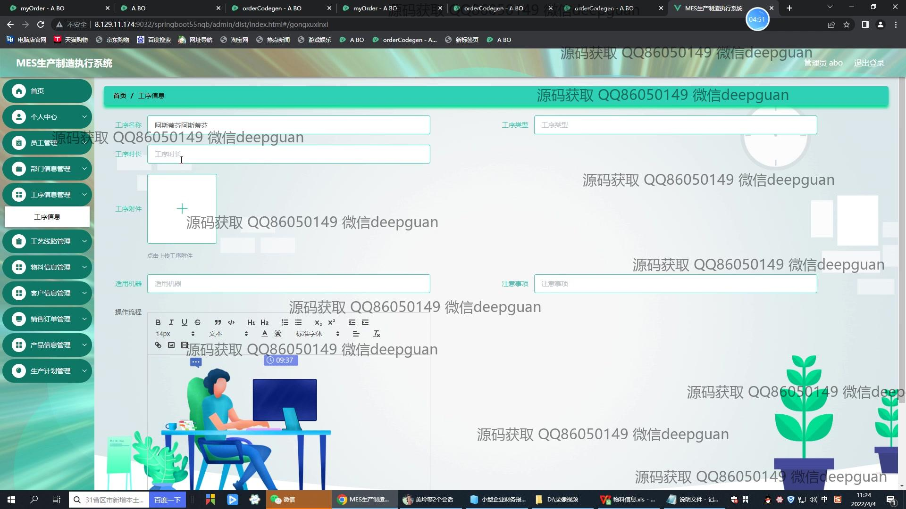
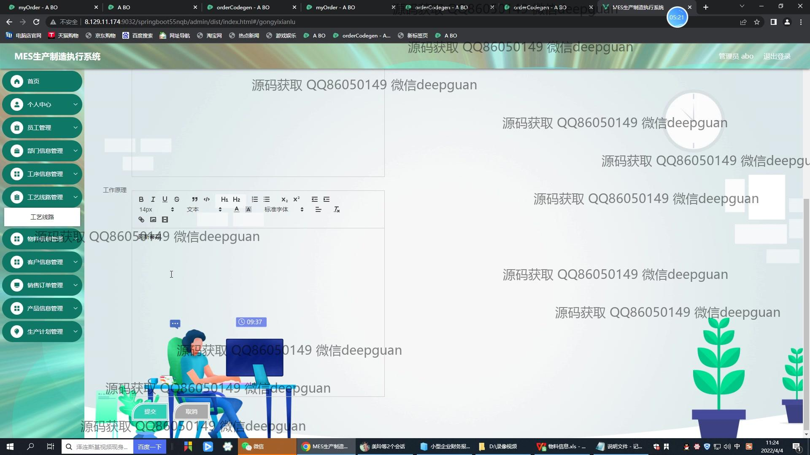

<h1 align="center">基于Vue的MES生产制造执行系统</h1>

## 简介
基于Vue和Spring Boot开发的MES系统：支持管理员和员工角色，提供员工管理、订单管理、生产计划管理、工序信息管理、客户信息管理等多种功能，实现高效的生产管理和信息维护。    --计算机毕业设计源码；毕设源码；java毕业设计源码

## 联系方式

<h3 align="center">获取完整代码与数据库文件 + 微信：deepguan QQ: 86050149 QQ群: 783742310</h3>

<h3 align="center">可帮忙远程部署 包运行成功！提供远程部署、修改代码、设计文档指导、代码讲解等服务！</h3>

## 功能介绍（完整见运行截图）
管理员：管理员可以通过登录界面进行身份验证，访问系统的各种功能模块。管理员拥有对员工信息、部门信息、生产计划、工序信息和物料信息的全面管理权限，包括查看、编辑、删除和提交等操作。管理员还负责维护客户信息和订单管理，确保销售和生产信息的准确记录和更新。此外，还有权限查看系统的统计报表，分析生产数据以支持决策，同时可以对导航菜单和登录信息进行配置和管理，实现系统的全方位监控和维护。

员工：员工在系统中主要通过登录界面进行身份验证后，依据分配的角色权限访问所需的模块和功能。员工可以管理个人信息，查看并更新一些基本数据如生产计划、工序信息，以及参与到物料和客户信息的管理中，为生产过程提供支持。除此之外，员工在系统中也参与到生产订单的录入与跟踪，通过填写相关表单如工序名称、产品信息和工艺流程等来确保信息的实时更新和准确记录。通过简洁直观的界面设计，员工能快速导航并高效完成工作任务。

## 运行截图

本代码来源于网络,仅供学习参考使用!

